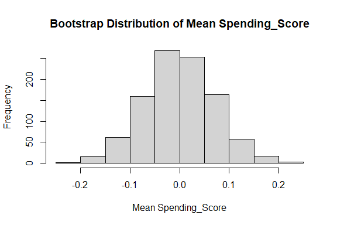
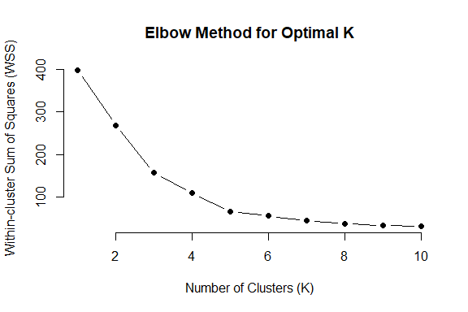
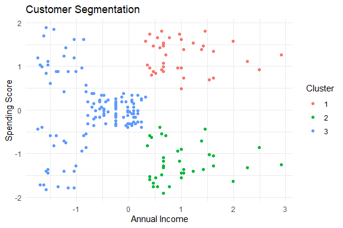

Mall Customer Segmentation
================
Trevor Okinda

- [Student Details](#student-details)
- [Setup Chunk](#setup-chunk)
- [Understanding the Dataset (Exploratory Data Analysis
  (EDA))](#understanding-the-dataset-exploratory-data-analysis-eda)
  - [Loading the Dataset](#loading-the-dataset)
    - [Source:](#source)
    - [Reference:](#reference)
    - [Measures of Frequency](#measures-of-frequency)
    - [Measures of relationship](#measures-of-relationship)
    - [Measures of Distribution](#measures-of-distribution)
    - [Measures of Relationship](#measures-of-relationship-1)
    - [ANOVA](#anova)
    - [Univariate Plots](#univariate-plots)
    - [Multivariate Plots](#multivariate-plots)
    - [Check for missingness](#check-for-missingness)
    - [Data Transformations](#data-transformations)
    - [Data splitting](#data-splitting)
    - [Boostrapping](#boostrapping)
    - [Cross-validation](#cross-validation)
    - [Model Training](#model-training)
    - [Performance Comparison](#performance-comparison)
    - [Saving the Model](#saving-the-model)

# Student Details

|                       |                            |
|-----------------------|----------------------------|
| **Student ID Number** | 134780                     |
| **Student Name**      | Trevor Okinda              |
| **BBIT 4.2 Group**    | C                          |
| **Project Name**      | Mall Customer Segmentation |

# Setup Chunk

**Note:** the following KnitR options have been set as the global
defaults: <BR>
`knitr::opts_chunk$set(echo = TRUE, warning = FALSE, eval = TRUE, collapse = FALSE, tidy = TRUE)`.

More KnitR options are documented here
<https://bookdown.org/yihui/rmarkdown-cookbook/chunk-options.html> and
here <https://yihui.org/knitr/options/>.

# Understanding the Dataset (Exploratory Data Analysis (EDA))

## Loading the Dataset

### Source:

The dataset that was used can be downloaded here: *\<<a
href="https://www.kaggle.com/datasets/rahulsah06/titanic?resource=download\"
class="uri">https://www.kaggle.com/datasets/rahulsah06/titanic?resource=download\</a>\>*

### Reference:

*\<Avagyan, Z. (2017). Weather CSV \[Data set\]. Kaggle.
<a href="https://www.kaggle.com/datasets/zaraavagyan/weathercsv\"
class="uri">https://www.kaggle.com/datasets/zaraavagyan/weathercsv\</a>\>  
Refer to the APA 7th edition manual for rules on how to cite datasets:
<https://apastyle.apa.org/style-grammar-guidelines/references/examples/data-set-references>*

``` r
#Load Dataset

CustomerData <-read.csv("Customers.csv", colClasses = c(
  CustomerId = "numeric",
  Gender = "factor",
  Age = "numeric",
  Annual_Income = "numeric",
  Spending_Score = "numeric"
))

#View Dataset
View(CustomerData)
```

### Measures of Frequency

``` r
#Measures of Frequency
# Display the structure of the dataset
str(CustomerData)
```

    ## 'data.frame':    200 obs. of  5 variables:
    ##  $ CustomerID    : int  1 2 3 4 5 6 7 8 9 10 ...
    ##  $ Gender        : Factor w/ 2 levels "Female","Male": 2 2 1 1 1 1 1 1 2 1 ...
    ##  $ Age           : num  19 21 20 23 31 22 35 23 64 30 ...
    ##  $ Annual_Income : num  15 15 16 16 17 17 18 18 19 19 ...
    ##  $ Spending_Score: num  39 81 6 77 40 76 6 94 3 72 ...

``` r
# Display summary statistics
summary(CustomerData)
```

    ##    CustomerID        Gender         Age        Annual_Income    Spending_Score 
    ##  Min.   :  1.00   Female:112   Min.   :18.00   Min.   : 15.00   Min.   : 1.00  
    ##  1st Qu.: 50.75   Male  : 88   1st Qu.:28.75   1st Qu.: 41.50   1st Qu.:34.75  
    ##  Median :100.50                Median :36.00   Median : 61.50   Median :50.00  
    ##  Mean   :100.50                Mean   :38.85   Mean   : 60.56   Mean   :50.20  
    ##  3rd Qu.:150.25                3rd Qu.:49.00   3rd Qu.: 78.00   3rd Qu.:73.00  
    ##  Max.   :200.00                Max.   :70.00   Max.   :137.00   Max.   :99.00

``` r
# Frequency table for Gender
gender_frequency <- table(CustomerData$Gender)
print("Frequency table for Gender:")
```

    ## [1] "Frequency table for Gender:"

``` r
print(gender_frequency)
```

    ## 
    ## Female   Male 
    ##    112     88

``` r
# Histogram for Age
hist(CustomerData$Age, main = "Histogram of Age", xlab = "Age")
```

<!-- -->

``` r
# Histogram for Annual Income
hist(CustomerData$Annual_Income, main = "Histogram of Annual Income", xlab = "Annual Income")
```

<!-- -->

``` r
# Histogram for Spending Score
hist(CustomerData$Spending_Score, main = "Histogram of Spending Score", xlab = "Spending Score")
```

<!-- -->

### Measures of relationship

``` r
#Measures of Central Tendency
# Display mean, median, and mode for Age
mean_age <- mean(CustomerData$Age)
median_age <- median(CustomerData$Age)
mode_age <- names(sort(-table(CustomerData$Age)))[1]

print("Measures of Central Tendency for Age:")
```

    ## [1] "Measures of Central Tendency for Age:"

``` r
print(paste("Mean:", mean_age))
```

    ## [1] "Mean: 38.85"

``` r
print(paste("Median:", median_age))
```

    ## [1] "Median: 36"

``` r
print(paste("Mode:", mode_age))
```

    ## [1] "Mode: 32"

``` r
# Display mean, median, and mode for Annual Income
mean_income <- mean(CustomerData$Annual_Income)
median_income <- median(CustomerData$Annual_Income)
mode_income <- names(sort(-table(CustomerData$Annual_Income)))[1]

print("Measures of Central Tendency for Annual Income:")
```

    ## [1] "Measures of Central Tendency for Annual Income:"

``` r
print(paste("Mean:", mean_income))
```

    ## [1] "Mean: 60.56"

``` r
print(paste("Median:", median_income))
```

    ## [1] "Median: 61.5"

``` r
print(paste("Mode:", mode_income))
```

    ## [1] "Mode: 54"

``` r
# Display mean, median, and mode for Spending Score
mean_score <- mean(CustomerData$Spending_Score)
median_score <- median(CustomerData$Spending_Score)
mode_score <- names(sort(-table(CustomerData$Spending_Score)))[1]

print("Measures of Central Tendency for Spending Score:")
```

    ## [1] "Measures of Central Tendency for Spending Score:"

``` r
print(paste("Mean:", mean_score))
```

    ## [1] "Mean: 50.2"

``` r
print(paste("Median:", median_score))
```

    ## [1] "Median: 50"

``` r
print(paste("Mode:", mode_score))
```

    ## [1] "Mode: 42"

### Measures of Distribution

``` r
#Measures of Distribution
# Display range for Age, Annual Income, and Spending Score
age_range <- range(CustomerData$Age)
income_range <- range(CustomerData$Annual_Income)
score_range <- range(CustomerData$Spending_Score)

print("Range for Age:")
```

    ## [1] "Range for Age:"

``` r
print(age_range)
```

    ## [1] 18 70

``` r
print("Range for Annual Income:")
```

    ## [1] "Range for Annual Income:"

``` r
print(income_range)
```

    ## [1]  15 137

``` r
print("Range for Spending Score:")
```

    ## [1] "Range for Spending Score:"

``` r
print(score_range)
```

    ## [1]  1 99

``` r
# Display standard deviation for Age, Annual Income, and Spending Score
sd_age <- sd(CustomerData$Age)
sd_income <- sd(CustomerData$Annual_Income)
sd_score <- sd(CustomerData$Spending_Score)

print("Standard Deviation for Age:")
```

    ## [1] "Standard Deviation for Age:"

``` r
print(sd_age)
```

    ## [1] 13.96901

``` r
print("Standard Deviation for Annual Income:")
```

    ## [1] "Standard Deviation for Annual Income:"

``` r
print(sd_income)
```

    ## [1] 26.26472

``` r
print("Standard Deviation for Spending Score:")
```

    ## [1] "Standard Deviation for Spending Score:"

``` r
print(sd_score)
```

    ## [1] 25.82352

``` r
# Display quantiles for Age, Annual Income, and Spending Score
quantiles_age <- quantile(CustomerData$Age)
quantiles_income <- quantile(CustomerData$Annual_Income)
quantiles_score <- quantile(CustomerData$Spending_Score)

print("Quantiles for Age:")
```

    ## [1] "Quantiles for Age:"

``` r
print(quantiles_age)
```

    ##    0%   25%   50%   75%  100% 
    ## 18.00 28.75 36.00 49.00 70.00

``` r
print("Quantiles for Annual Income:")
```

    ## [1] "Quantiles for Annual Income:"

``` r
print(quantiles_income)
```

    ##    0%   25%   50%   75%  100% 
    ##  15.0  41.5  61.5  78.0 137.0

``` r
print("Quantiles for Spending Score:")
```

    ## [1] "Quantiles for Spending Score:"

``` r
print(quantiles_score)
```

    ##    0%   25%   50%   75%  100% 
    ##  1.00 34.75 50.00 73.00 99.00

### Measures of Relationship

``` r
#Measures of Relationship
# Display correlation matrix
correlation_matrix <- cor(CustomerData[, c("Age", "Annual_Income", "Spending_Score")])
print("Correlation Matrix:")
```

    ## [1] "Correlation Matrix:"

``` r
print(correlation_matrix)
```

    ##                        Age Annual_Income Spending_Score
    ## Age             1.00000000  -0.012398043   -0.327226846
    ## Annual_Income  -0.01239804   1.000000000    0.009902848
    ## Spending_Score -0.32722685   0.009902848    1.000000000

``` r
# Scatter plot matrix
pairs(CustomerData[, c("Age", "Annual_Income", "Spending_Score")], main = "Scatter Plot Matrix")
```

<!-- -->

``` r
# Scatter plot between Annual Income and Spending Score
plot(CustomerData$Annual_Income, CustomerData$Spending_Score, main = "Scatter Plot: Annual Income vs Spending Score", 
     xlab = "Annual Income", ylab = "Spending Score", col = as.numeric(CustomerData$Gender))

# Add regression line to the scatter plot
abline(lm(Spending_Score ~ Annual_Income, data = CustomerData), col = "red")
```

<!-- -->

### ANOVA

``` r
#ANOVA
# Perform ANOVA for Age, Annual Income, and Spending Score based on Gender
anova_age <- aov(Age ~ Gender, data = CustomerData)
anova_income <- aov(Annual_Income ~ Gender, data = CustomerData)
anova_score <- aov(Spending_Score ~ Gender, data = CustomerData)

# Display ANOVA results
print("ANOVA for Age:")
```

    ## [1] "ANOVA for Age:"

``` r
print(summary(anova_age))
```

    ##              Df Sum Sq Mean Sq F value Pr(>F)
    ## Gender        1    144   143.9   0.736  0.392
    ## Residuals   198  38688   195.4

``` r
print("ANOVA for Annual Income:")
```

    ## [1] "ANOVA for Annual Income:"

``` r
print(summary(anova_income))
```

    ##              Df Sum Sq Mean Sq F value Pr(>F)
    ## Gender        1    437   436.8   0.632  0.428
    ## Residuals   198 136840   691.1

``` r
print("ANOVA for Spending Score:")
```

    ## [1] "ANOVA for Spending Score:"

``` r
print(summary(anova_score))
```

    ##              Df Sum Sq Mean Sq F value Pr(>F)
    ## Gender        1    448   448.1   0.671  0.414
    ## Residuals   198 132256   668.0

### Univariate Plots

``` r
#Univariate Plots
# Load the necessary libraries
library(ggplot2)
# Univariate plot for Age - Histogram
ggplot(CustomerData, aes(x = Age)) +
  geom_histogram(binwidth = 5, fill = "blue", color = "black", alpha = 0.7) +
  labs(title = "Histogram of Age", x = "Age", y = "Frequency")
```

<!-- -->

``` r
# Univariate plot for Annual Income - Boxplot
ggplot(CustomerData, aes(x = 1, y = Annual_Income, fill = Gender)) +
  geom_boxplot() +
  labs(title = "Boxplot of Annual Income", x = "", y = "Annual Income") +
  scale_fill_manual(values = c("pink", "lightblue"))
```

<!-- -->

``` r
# Univariate plot for Spending Score - Density Plot
ggplot(CustomerData, aes(x = Spending_Score, fill = Gender)) +
  geom_density(alpha = 0.5) +
  labs(title = "Density Plot of Spending Score", x = "Spending Score", y = "Density") +
  scale_fill_manual(values = c("pink", "lightblue"))
```

<!-- -->

### Multivariate Plots

``` r
#MultiVariate Plots
# Load the necessary libraries
library(ggplot2)

# Multivariate scatter plot matrix
ggplot(CustomerData, aes(x = Age, y = Annual_Income, color = Gender)) +
  geom_point() +
  labs(title = "Scatter Plot Matrix", x = "Age", y = "Annual Income") +
  theme_minimal()
```

<!-- -->

``` r
# Multivariate scatter plot for Spending Score vs. Annual Income
ggplot(CustomerData, aes(x = Annual_Income, y = Spending_Score, color = Gender)) +
  geom_point() +
  labs(title = "Scatter Plot: Spending Score vs. Annual Income", x = "Annual Income", y = "Spending Score") +
  theme_minimal()
```

<!-- -->

### Check for missingness

``` r
# Check for missing values
missing_values <- sum(is.na(CustomerData))

# Display confirmation
if (missing_values > 0) {
  print("Missing values are present in the dataset.")
  print(paste("Total missing values: ", missing_values))
  print("Columns with missing values:")
  print(names(CustomerData)[colSums(is.na(CustomerData)) > 0])
} else {
  print("No missing values are present in the dataset.")
}
```

    ## [1] "No missing values are present in the dataset."

### Data Transformations

``` r
# Data transformations

# Standardizing numeric variables (Age, Annual_Income, Spending_Score)
numeric_cols <- c("Age", "Annual_Income", "Spending_Score")
CustomerData[numeric_cols] <- scale(CustomerData[numeric_cols])

# Creating a new feature (Age category)
CustomerData$Age_Category <- cut(CustomerData$Age, breaks = c(0, 30, 50, Inf), labels = c("Young", "Middle-aged", "Senior"))

# Display the transformed dataset
head(CustomerData)
```

    ##   CustomerID Gender        Age Annual_Income Spending_Score Age_Category
    ## 1          1   Male -1.4210029     -1.734646     -0.4337131         <NA>
    ## 2          2   Male -1.2778288     -1.734646      1.1927111         <NA>
    ## 3          3 Female -1.3494159     -1.696572     -1.7116178         <NA>
    ## 4          4 Female -1.1346547     -1.696572      1.0378135         <NA>
    ## 5          5 Female -0.5619583     -1.658498     -0.3949887         <NA>
    ## 6          6 Female -1.2062418     -1.658498      0.9990891         <NA>

### Data splitting

``` r
# Data Splitting
# Install and load the necessary libraries
library(caret)
```

    ## Loading required package: lattice

``` r
# Set a seed for reproducibility
set.seed(123)

# Specify the proportion for training and testing sets
split_ratio <- 0.8  # 80% for training, 20% for testing

# Split the data
splitIndex <- createDataPartition(CustomerData$Spending_Score, p = split_ratio, list = FALSE)
train_data <- CustomerData[splitIndex, ]
test_data <- CustomerData[-splitIndex, ]

# Display the dimensions of the split datasets
cat("Training data dimensions:", dim(train_data), "\n")
```

    ## Training data dimensions: 161 6

``` r
cat("Testing data dimensions:", dim(test_data), "\n")
```

    ## Testing data dimensions: 39 6

### Boostrapping

``` r
#Bootstrapping
# Load the necessary libraries
library(boot)
```

    ## 
    ## Attaching package: 'boot'

    ## The following object is masked from 'package:lattice':
    ## 
    ##     melanoma

``` r
# Set a seed for reproducibility
set.seed(123)

# Function to calculate the mean of the variable of interest
calculate_mean <- function(data, indices) {
  sample_data <- data[indices, ]
  return(mean(sample_data$Spending_Score))
}

# Number of bootstrap samples
num_boot_samples <- 1000

# Perform bootstrapping
boot_results <- boot(data = CustomerData, statistic = calculate_mean, R = num_boot_samples)

# Display the bootstrap results
print("Bootstrap Results:")
```

    ## [1] "Bootstrap Results:"

``` r
print(boot_results)
```

    ## 
    ## ORDINARY NONPARAMETRIC BOOTSTRAP
    ## 
    ## 
    ## Call:
    ## boot(data = CustomerData, statistic = calculate_mean, R = num_boot_samples)
    ## 
    ## 
    ## Bootstrap Statistics :
    ##          original        bias    std. error
    ## t1* -1.096708e-16 -0.0001771641  0.07078456

``` r
# Plot the bootstrap distribution
hist(boot_results$t, main = "Bootstrap Distribution of Mean Spending_Score", xlab = "Mean Spending_Score")
```

<!-- -->

### Cross-validation

``` r
# Load the necessary libraries
install.packages("caret")
library(caret)

# Set a seed for reproducibility
set.seed(123)

# Specify the number of folds for cross-validation
num_folds <- 5

# Create a training control object for cross-validation
train_control <- trainControl(method = "cv", number = num_folds)

# Train a model (linear regression) using cross-validation
model <- train(Spending_Score ~ Age + Annual_Income + Gender, data = CustomerData, method = "lm", trControl = train_control)

# Display the cross-validation results
print("Cross-Validation Results:")
```

    ## [1] "Cross-Validation Results:"

``` r
print(model$results)
```

    ##   intercept      RMSE   Rsquared       MAE     RMSESD RsquaredSD      MAESD
    ## 1      TRUE 0.9574651 0.08691095 0.8066011 0.06061771 0.03892875 0.06058021

### Model Training

``` r
# Model Training
# Load the necessary libraries
# install.packages("ggplot2")
library(ggplot2)

# Load the dataset
# Select relevant features for clustering
features <- CustomerData[, c("Annual_Income", "Spending_Score")]

# Set a seed for reproducibility
set.seed(123)

# Determine the optimal number of clusters (K) using the elbow method
wss <- numeric(10)
for (i in 1:10) {
  kmeans_model <- kmeans(features, centers = i, nstart = 10)
  wss[i] <- sum(kmeans_model$withinss)
}

# Plot the elbow curve
plot(1:10, wss, type = "b", pch = 19, frame = FALSE, main = "Elbow Method for Optimal K",
     xlab = "Number of Clusters (K)", ylab = "Within-cluster Sum of Squares (WSS)")
```

<!-- -->

``` r
# Determine the optimal K visually (elbow point)
optimal_k <- 3  # Replace with the visually determined optimal K

# Apply K-means clustering with the optimal K
kmeans_model <- kmeans(features, centers = optimal_k, nstart = 10)

# Add cluster information to the original dataset
CustomerData$Cluster <- as.factor(kmeans_model$cluster)

# Plot the clusters
ggplot(CustomerData, aes(x = Annual_Income, y = Spending_Score, color = Cluster)) +
  geom_point() +
  labs(title = "Customer Segmentation", x = "Annual Income", y = "Spending Score") +
  theme_minimal()
```

<!-- -->

### Performance Comparison

``` r
#Performance Comparison
# Load the necessary libraries
library(cluster)  # For k-means clustering
library(dbscan)   # For DBSCAN
```

    ## 
    ## Attaching package: 'dbscan'

    ## The following object is masked from 'package:stats':
    ## 
    ##     as.dendrogram

``` r
library(fpc)      # For silhouette measure
```

    ## 
    ## Attaching package: 'fpc'

    ## The following object is masked from 'package:dbscan':
    ## 
    ##     dbscan

``` r
# Set a seed for reproducibility
set.seed(123)

# Select relevant features for clustering
clustering_features <- CustomerData[, c("Annual_Income", "Spending_Score")]

# Specify the number of clusters for k-means
num_clusters <- 3

# Fit the clustering models
kmeans_model <- kmeans(clustering_features, centers = num_clusters)
dbscan_model <- dbscan(clustering_features, eps = 0.5, MinPts = 5)
pam_model <- pam(clustering_features, k = num_clusters)

# Evaluate clustering quality using silhouette width
silhouette_kmeans <- silhouette(kmeans_model$cluster, dist(clustering_features))
silhouette_dbscan <- silhouette(dbscan_model$cluster, dist(clustering_features))
silhouette_pam <- silhouette(pam_model$cluster, dist(clustering_features))

# Print silhouette width for each clustering model
cat("K-means Silhouette Width:", mean(silhouette_kmeans[, 3]), "\n")
```

    ## K-means Silhouette Width: 0.3853219

``` r
cat("DBSCAN Silhouette Width:", mean(silhouette_dbscan[, 3]), "\n")
```

    ## DBSCAN Silhouette Width: 0.3504462

``` r
cat("PAM Silhouette Width:", mean(silhouette_pam[, 3]), "\n")
```

    ## PAM Silhouette Width: 0.4641152

### Saving the Model

``` r
# Load the necessary libraries
library(cluster)

# Load the dataset
CustomerData <- read.csv("Customers.csv", colClasses = c(
  CustomerId = "numeric",
  Gender = "factor",
  Age = "numeric",
  Annual_Income = "numeric",
  Spending_Score = "numeric"
))

# Set a seed for reproducibility
set.seed(123)

# Select relevant features for clustering
clustering_features <- CustomerData[, c("Annual_Income", "Spending_Score")]

# Specify the number of clusters for k-means
num_clusters <- 5

# Calculate the Euclidean distance matrix
distances <- dist(clustering_features)

# Perform hierarchical clustering
hclust_model <- hclust(distances, method = "ward")
```

    ## The "ward" method has been renamed to "ward.D"; note new "ward.D2"

``` r
# Save the hclust model and the cut points
saveRDS(hclust_model, "./models/saved_hclust_model.rds")
saveRDS(num_clusters, "./models/saved_hclust_num_clusters.rds")

# Load the saved hclust model and num_clusters
loaded_hclust_model <- readRDS("./models/saved_hclust_model.rds")
loaded_num_clusters <- readRDS("./models/saved_hclust_num_clusters.rds")

# Cut the tree to get k clusters using loaded information
kmeans_clusters <- cutree(loaded_hclust_model, k = loaded_num_clusters)

# Create a new dataframe with cluster assignments
clustered_data <- cbind(CustomerData, Cluster = kmeans_clusters)

# Display the resulting dataframe
print(clustered_data)
```

    ##     CustomerID Gender Age Annual_Income Spending_Score Cluster
    ## 1            1   Male  19            15             39       1
    ## 2            2   Male  21            15             81       2
    ## 3            3 Female  20            16              6       1
    ## 4            4 Female  23            16             77       2
    ## 5            5 Female  31            17             40       1
    ## 6            6 Female  22            17             76       2
    ## 7            7 Female  35            18              6       1
    ## 8            8 Female  23            18             94       2
    ## 9            9   Male  64            19              3       1
    ## 10          10 Female  30            19             72       2
    ## 11          11   Male  67            19             14       1
    ## 12          12 Female  35            19             99       2
    ## 13          13 Female  58            20             15       1
    ## 14          14 Female  24            20             77       2
    ## 15          15   Male  37            20             13       1
    ## 16          16   Male  22            20             79       2
    ## 17          17 Female  35            21             35       1
    ## 18          18   Male  20            21             66       2
    ## 19          19   Male  52            23             29       1
    ## 20          20 Female  35            23             98       2
    ## 21          21   Male  35            24             35       1
    ## 22          22   Male  25            24             73       2
    ## 23          23 Female  46            25              5       1
    ## 24          24   Male  31            25             73       2
    ## 25          25 Female  54            28             14       1
    ## 26          26   Male  29            28             82       2
    ## 27          27 Female  45            28             32       1
    ## 28          28   Male  35            28             61       2
    ## 29          29 Female  40            29             31       1
    ## 30          30 Female  23            29             87       2
    ## 31          31   Male  60            30              4       1
    ## 32          32 Female  21            30             73       2
    ## 33          33   Male  53            33              4       1
    ## 34          34   Male  18            33             92       2
    ## 35          35 Female  49            33             14       1
    ## 36          36 Female  21            33             81       2
    ## 37          37 Female  42            34             17       1
    ## 38          38 Female  30            34             73       2
    ## 39          39 Female  36            37             26       1
    ## 40          40 Female  20            37             75       2
    ## 41          41 Female  65            38             35       1
    ## 42          42   Male  24            38             92       2
    ## 43          43   Male  48            39             36       1
    ## 44          44 Female  31            39             61       3
    ## 45          45 Female  49            39             28       1
    ## 46          46 Female  24            39             65       3
    ## 47          47 Female  50            40             55       3
    ## 48          48 Female  27            40             47       3
    ## 49          49 Female  29            40             42       3
    ## 50          50 Female  31            40             42       3
    ## 51          51 Female  49            42             52       3
    ## 52          52   Male  33            42             60       3
    ## 53          53 Female  31            43             54       3
    ## 54          54   Male  59            43             60       3
    ## 55          55 Female  50            43             45       3
    ## 56          56   Male  47            43             41       3
    ## 57          57 Female  51            44             50       3
    ## 58          58   Male  69            44             46       3
    ## 59          59 Female  27            46             51       3
    ## 60          60   Male  53            46             46       3
    ## 61          61   Male  70            46             56       3
    ## 62          62   Male  19            46             55       3
    ## 63          63 Female  67            47             52       3
    ## 64          64 Female  54            47             59       3
    ## 65          65   Male  63            48             51       3
    ## 66          66   Male  18            48             59       3
    ## 67          67 Female  43            48             50       3
    ## 68          68 Female  68            48             48       3
    ## 69          69   Male  19            48             59       3
    ## 70          70 Female  32            48             47       3
    ## 71          71   Male  70            49             55       3
    ## 72          72 Female  47            49             42       3
    ## 73          73 Female  60            50             49       3
    ## 74          74 Female  60            50             56       3
    ## 75          75   Male  59            54             47       3
    ## 76          76   Male  26            54             54       3
    ## 77          77 Female  45            54             53       3
    ## 78          78   Male  40            54             48       3
    ## 79          79 Female  23            54             52       3
    ## 80          80 Female  49            54             42       3
    ## 81          81   Male  57            54             51       3
    ## 82          82   Male  38            54             55       3
    ## 83          83   Male  67            54             41       3
    ## 84          84 Female  46            54             44       3
    ## 85          85 Female  21            54             57       3
    ## 86          86   Male  48            54             46       3
    ## 87          87 Female  55            57             58       3
    ## 88          88 Female  22            57             55       3
    ## 89          89 Female  34            58             60       3
    ## 90          90 Female  50            58             46       3
    ## 91          91 Female  68            59             55       3
    ## 92          92   Male  18            59             41       3
    ## 93          93   Male  48            60             49       3
    ## 94          94 Female  40            60             40       3
    ## 95          95 Female  32            60             42       3
    ## 96          96   Male  24            60             52       3
    ## 97          97 Female  47            60             47       3
    ## 98          98 Female  27            60             50       3
    ## 99          99   Male  48            61             42       3
    ## 100        100   Male  20            61             49       3
    ## 101        101 Female  23            62             41       3
    ## 102        102 Female  49            62             48       3
    ## 103        103   Male  67            62             59       3
    ## 104        104   Male  26            62             55       3
    ## 105        105   Male  49            62             56       3
    ## 106        106 Female  21            62             42       3
    ## 107        107 Female  66            63             50       3
    ## 108        108   Male  54            63             46       3
    ## 109        109   Male  68            63             43       3
    ## 110        110   Male  66            63             48       3
    ## 111        111   Male  65            63             52       3
    ## 112        112 Female  19            63             54       3
    ## 113        113 Female  38            64             42       3
    ## 114        114   Male  19            64             46       3
    ## 115        115 Female  18            65             48       3
    ## 116        116 Female  19            65             50       3
    ## 117        117 Female  63            65             43       3
    ## 118        118 Female  49            65             59       3
    ## 119        119 Female  51            67             43       3
    ## 120        120 Female  50            67             57       3
    ## 121        121   Male  27            67             56       3
    ## 122        122 Female  38            67             40       3
    ## 123        123 Female  40            69             58       3
    ## 124        124   Male  39            69             91       4
    ## 125        125 Female  23            70             29       3
    ## 126        126 Female  31            70             77       4
    ## 127        127   Male  43            71             35       3
    ## 128        128   Male  40            71             95       4
    ## 129        129   Male  59            71             11       5
    ## 130        130   Male  38            71             75       4
    ## 131        131   Male  47            71              9       5
    ## 132        132   Male  39            71             75       4
    ## 133        133 Female  25            72             34       3
    ## 134        134 Female  31            72             71       4
    ## 135        135   Male  20            73              5       5
    ## 136        136 Female  29            73             88       4
    ## 137        137 Female  44            73              7       5
    ## 138        138   Male  32            73             73       4
    ## 139        139   Male  19            74             10       5
    ## 140        140 Female  35            74             72       4
    ## 141        141 Female  57            75              5       5
    ## 142        142   Male  32            75             93       4
    ## 143        143 Female  28            76             40       3
    ## 144        144 Female  32            76             87       4
    ## 145        145   Male  25            77             12       5
    ## 146        146   Male  28            77             97       4
    ## 147        147   Male  48            77             36       3
    ## 148        148 Female  32            77             74       4
    ## 149        149 Female  34            78             22       5
    ## 150        150   Male  34            78             90       4
    ## 151        151   Male  43            78             17       5
    ## 152        152   Male  39            78             88       4
    ## 153        153 Female  44            78             20       5
    ## 154        154 Female  38            78             76       4
    ## 155        155 Female  47            78             16       5
    ## 156        156 Female  27            78             89       4
    ## 157        157   Male  37            78              1       5
    ## 158        158 Female  30            78             78       4
    ## 159        159   Male  34            78              1       5
    ## 160        160 Female  30            78             73       4
    ## 161        161 Female  56            79             35       3
    ## 162        162 Female  29            79             83       4
    ## 163        163   Male  19            81              5       5
    ## 164        164 Female  31            81             93       4
    ## 165        165   Male  50            85             26       5
    ## 166        166 Female  36            85             75       4
    ## 167        167   Male  42            86             20       5
    ## 168        168 Female  33            86             95       4
    ## 169        169 Female  36            87             27       5
    ## 170        170   Male  32            87             63       4
    ## 171        171   Male  40            87             13       5
    ## 172        172   Male  28            87             75       4
    ## 173        173   Male  36            87             10       5
    ## 174        174   Male  36            87             92       4
    ## 175        175 Female  52            88             13       5
    ## 176        176 Female  30            88             86       4
    ## 177        177   Male  58            88             15       5
    ## 178        178   Male  27            88             69       4
    ## 179        179   Male  59            93             14       5
    ## 180        180   Male  35            93             90       4
    ## 181        181 Female  37            97             32       5
    ## 182        182 Female  32            97             86       4
    ## 183        183   Male  46            98             15       5
    ## 184        184 Female  29            98             88       4
    ## 185        185 Female  41            99             39       5
    ## 186        186   Male  30            99             97       4
    ## 187        187 Female  54           101             24       5
    ## 188        188   Male  28           101             68       4
    ## 189        189 Female  41           103             17       5
    ## 190        190 Female  36           103             85       4
    ## 191        191 Female  34           103             23       5
    ## 192        192 Female  32           103             69       4
    ## 193        193   Male  33           113              8       5
    ## 194        194 Female  38           113             91       4
    ## 195        195 Female  47           120             16       5
    ## 196        196 Female  35           120             79       4
    ## 197        197 Female  45           126             28       5
    ## 198        198   Male  32           126             74       4
    ## 199        199   Male  32           137             18       5
    ## 200        200   Male  30           137             83       4
