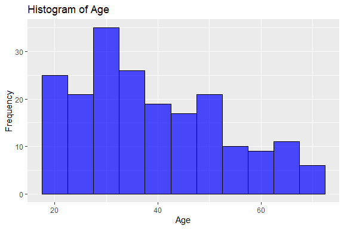

Mall Customer Segmentation
================
Trevor Okinda

- [Student Details](#student-details)
- [Setup Chunk](#setup-chunk)
- [Understanding the Dataset (Exploratory Data Analysis
  (EDA))](#understanding-the-dataset-exploratory-data-analysis-eda)
  - [Loading the Dataset](#loading-the-dataset)
    - [Source:](#source)
    - [Reference:](#reference)
    - [Measures of Frequency](#measures-of-frequency)
    - [Measures of relationship](#measures-of-relationship)
    - [Measures of Distribution](#measures-of-distribution)
    - [Measures of Relationship](#measures-of-relationship-1)
    - [ANOVA](#anova)
    - [Univariate Plots](#univariate-plots)
    - [Multivariate Plots](#multivariate-plots)
    - [Check for missingness](#check-for-missingness)
    - [Data Transformations](#data-transformations)

# Student Details

|                       |                            |
|-----------------------|----------------------------|
| **Student ID Number** | 134780                     |
| **Student Name**      | Trevor Okinda              |
| **BBIT 4.2 Group**    | C                          |
| **Project Name**      | Mall Customer Segmentation |

# Setup Chunk

**Note:** the following KnitR options have been set as the global
defaults: <BR>
`knitr::opts_chunk$set(echo = TRUE, warning = FALSE, eval = TRUE, collapse = FALSE, tidy = TRUE)`.

More KnitR options are documented here
<https://bookdown.org/yihui/rmarkdown-cookbook/chunk-options.html> and
here <https://yihui.org/knitr/options/>.

# Understanding the Dataset (Exploratory Data Analysis (EDA))

## Loading the Dataset

### Source:

The dataset that was used can be downloaded here: *\<<a
href="https://www.kaggle.com/datasets/rahulsah06/titanic?resource=download\"
class="uri">https://www.kaggle.com/datasets/rahulsah06/titanic?resource=download\</a>\>*

### Reference:

*\<Avagyan, Z. (2017). Weather CSV \[Data set\]. Kaggle.
<a href="https://www.kaggle.com/datasets/zaraavagyan/weathercsv\"
class="uri">https://www.kaggle.com/datasets/zaraavagyan/weathercsv\</a>\>  
Refer to the APA 7th edition manual for rules on how to cite datasets:
<https://apastyle.apa.org/style-grammar-guidelines/references/examples/data-set-references>*

``` r
#Load Dataset

CustomerData <-read.csv("Customers.csv", colClasses = c(
  CustomerId = "numeric",
  Gender = "factor",
  Age = "numeric",
  Annual_Income = "numeric",
  Spending_Score = "numeric"
))

#View Dataset
View(CustomerData)
```

### Measures of Frequency

``` r
#Measures of Frequency
# Display the structure of the dataset
str(CustomerData)
```

    ## 'data.frame':    200 obs. of  5 variables:
    ##  $ CustomerID    : int  1 2 3 4 5 6 7 8 9 10 ...
    ##  $ Gender        : Factor w/ 2 levels "Female","Male": 2 2 1 1 1 1 1 1 2 1 ...
    ##  $ Age           : num  19 21 20 23 31 22 35 23 64 30 ...
    ##  $ Annual_Income : num  15 15 16 16 17 17 18 18 19 19 ...
    ##  $ Spending_Score: num  39 81 6 77 40 76 6 94 3 72 ...

``` r
# Display summary statistics
summary(CustomerData)
```

    ##    CustomerID        Gender         Age        Annual_Income    Spending_Score 
    ##  Min.   :  1.00   Female:112   Min.   :18.00   Min.   : 15.00   Min.   : 1.00  
    ##  1st Qu.: 50.75   Male  : 88   1st Qu.:28.75   1st Qu.: 41.50   1st Qu.:34.75  
    ##  Median :100.50                Median :36.00   Median : 61.50   Median :50.00  
    ##  Mean   :100.50                Mean   :38.85   Mean   : 60.56   Mean   :50.20  
    ##  3rd Qu.:150.25                3rd Qu.:49.00   3rd Qu.: 78.00   3rd Qu.:73.00  
    ##  Max.   :200.00                Max.   :70.00   Max.   :137.00   Max.   :99.00

``` r
# Frequency table for Gender
gender_frequency <- table(CustomerData$Gender)
print("Frequency table for Gender:")
```

    ## [1] "Frequency table for Gender:"

``` r
print(gender_frequency)
```

    ## 
    ## Female   Male 
    ##    112     88

``` r
# Histogram for Age
hist(CustomerData$Age, main = "Histogram of Age", xlab = "Age")
```

<!-- -->

``` r
# Histogram for Annual Income
hist(CustomerData$Annual_Income, main = "Histogram of Annual Income", xlab = "Annual Income")
```

<!-- -->

``` r
# Histogram for Spending Score
hist(CustomerData$Spending_Score, main = "Histogram of Spending Score", xlab = "Spending Score")
```

<!-- -->

### Measures of relationship

``` r
#Measures of Central Tendency
# Display mean, median, and mode for Age
mean_age <- mean(CustomerData$Age)
median_age <- median(CustomerData$Age)
mode_age <- names(sort(-table(CustomerData$Age)))[1]

print("Measures of Central Tendency for Age:")
```

    ## [1] "Measures of Central Tendency for Age:"

``` r
print(paste("Mean:", mean_age))
```

    ## [1] "Mean: 38.85"

``` r
print(paste("Median:", median_age))
```

    ## [1] "Median: 36"

``` r
print(paste("Mode:", mode_age))
```

    ## [1] "Mode: 32"

``` r
# Display mean, median, and mode for Annual Income
mean_income <- mean(CustomerData$Annual_Income)
median_income <- median(CustomerData$Annual_Income)
mode_income <- names(sort(-table(CustomerData$Annual_Income)))[1]

print("Measures of Central Tendency for Annual Income:")
```

    ## [1] "Measures of Central Tendency for Annual Income:"

``` r
print(paste("Mean:", mean_income))
```

    ## [1] "Mean: 60.56"

``` r
print(paste("Median:", median_income))
```

    ## [1] "Median: 61.5"

``` r
print(paste("Mode:", mode_income))
```

    ## [1] "Mode: 54"

``` r
# Display mean, median, and mode for Spending Score
mean_score <- mean(CustomerData$Spending_Score)
median_score <- median(CustomerData$Spending_Score)
mode_score <- names(sort(-table(CustomerData$Spending_Score)))[1]

print("Measures of Central Tendency for Spending Score:")
```

    ## [1] "Measures of Central Tendency for Spending Score:"

``` r
print(paste("Mean:", mean_score))
```

    ## [1] "Mean: 50.2"

``` r
print(paste("Median:", median_score))
```

    ## [1] "Median: 50"

``` r
print(paste("Mode:", mode_score))
```

    ## [1] "Mode: 42"

### Measures of Distribution

``` r
#Measures of Distribution
# Display range for Age, Annual Income, and Spending Score
age_range <- range(CustomerData$Age)
income_range <- range(CustomerData$Annual_Income)
score_range <- range(CustomerData$Spending_Score)

print("Range for Age:")
```

    ## [1] "Range for Age:"

``` r
print(age_range)
```

    ## [1] 18 70

``` r
print("Range for Annual Income:")
```

    ## [1] "Range for Annual Income:"

``` r
print(income_range)
```

    ## [1]  15 137

``` r
print("Range for Spending Score:")
```

    ## [1] "Range for Spending Score:"

``` r
print(score_range)
```

    ## [1]  1 99

``` r
# Display standard deviation for Age, Annual Income, and Spending Score
sd_age <- sd(CustomerData$Age)
sd_income <- sd(CustomerData$Annual_Income)
sd_score <- sd(CustomerData$Spending_Score)

print("Standard Deviation for Age:")
```

    ## [1] "Standard Deviation for Age:"

``` r
print(sd_age)
```

    ## [1] 13.96901

``` r
print("Standard Deviation for Annual Income:")
```

    ## [1] "Standard Deviation for Annual Income:"

``` r
print(sd_income)
```

    ## [1] 26.26472

``` r
print("Standard Deviation for Spending Score:")
```

    ## [1] "Standard Deviation for Spending Score:"

``` r
print(sd_score)
```

    ## [1] 25.82352

``` r
# Display quantiles for Age, Annual Income, and Spending Score
quantiles_age <- quantile(CustomerData$Age)
quantiles_income <- quantile(CustomerData$Annual_Income)
quantiles_score <- quantile(CustomerData$Spending_Score)

print("Quantiles for Age:")
```

    ## [1] "Quantiles for Age:"

``` r
print(quantiles_age)
```

    ##    0%   25%   50%   75%  100% 
    ## 18.00 28.75 36.00 49.00 70.00

``` r
print("Quantiles for Annual Income:")
```

    ## [1] "Quantiles for Annual Income:"

``` r
print(quantiles_income)
```

    ##    0%   25%   50%   75%  100% 
    ##  15.0  41.5  61.5  78.0 137.0

``` r
print("Quantiles for Spending Score:")
```

    ## [1] "Quantiles for Spending Score:"

``` r
print(quantiles_score)
```

    ##    0%   25%   50%   75%  100% 
    ##  1.00 34.75 50.00 73.00 99.00

### Measures of Relationship

``` r
#Measures of Relationship
# Display correlation matrix
correlation_matrix <- cor(CustomerData[, c("Age", "Annual_Income", "Spending_Score")])
print("Correlation Matrix:")
```

    ## [1] "Correlation Matrix:"

``` r
print(correlation_matrix)
```

    ##                        Age Annual_Income Spending_Score
    ## Age             1.00000000  -0.012398043   -0.327226846
    ## Annual_Income  -0.01239804   1.000000000    0.009902848
    ## Spending_Score -0.32722685   0.009902848    1.000000000

``` r
# Scatter plot matrix
pairs(CustomerData[, c("Age", "Annual_Income", "Spending_Score")], main = "Scatter Plot Matrix")
```

<!-- -->

``` r
# Scatter plot between Annual Income and Spending Score
plot(CustomerData$Annual_Income, CustomerData$Spending_Score, main = "Scatter Plot: Annual Income vs Spending Score", 
     xlab = "Annual Income", ylab = "Spending Score", col = as.numeric(CustomerData$Gender))

# Add regression line to the scatter plot
abline(lm(Spending_Score ~ Annual_Income, data = CustomerData), col = "red")
```

<!-- -->

### ANOVA

``` r
#ANOVA
# Perform ANOVA for Age, Annual Income, and Spending Score based on Gender
anova_age <- aov(Age ~ Gender, data = CustomerData)
anova_income <- aov(Annual_Income ~ Gender, data = CustomerData)
anova_score <- aov(Spending_Score ~ Gender, data = CustomerData)

# Display ANOVA results
print("ANOVA for Age:")
```

    ## [1] "ANOVA for Age:"

``` r
print(summary(anova_age))
```

    ##              Df Sum Sq Mean Sq F value Pr(>F)
    ## Gender        1    144   143.9   0.736  0.392
    ## Residuals   198  38688   195.4

``` r
print("ANOVA for Annual Income:")
```

    ## [1] "ANOVA for Annual Income:"

``` r
print(summary(anova_income))
```

    ##              Df Sum Sq Mean Sq F value Pr(>F)
    ## Gender        1    437   436.8   0.632  0.428
    ## Residuals   198 136840   691.1

``` r
print("ANOVA for Spending Score:")
```

    ## [1] "ANOVA for Spending Score:"

``` r
print(summary(anova_score))
```

    ##              Df Sum Sq Mean Sq F value Pr(>F)
    ## Gender        1    448   448.1   0.671  0.414
    ## Residuals   198 132256   668.0

### Univariate Plots

``` r
#Univariate Plots
# Load the necessary libraries
library(ggplot2)
# Univariate plot for Age - Histogram
ggplot(CustomerData, aes(x = Age)) +
  geom_histogram(binwidth = 5, fill = "blue", color = "black", alpha = 0.7) +
  labs(title = "Histogram of Age", x = "Age", y = "Frequency")
```

<!-- -->

``` r
# Univariate plot for Annual Income - Boxplot
ggplot(CustomerData, aes(x = 1, y = Annual_Income, fill = Gender)) +
  geom_boxplot() +
  labs(title = "Boxplot of Annual Income", x = "", y = "Annual Income") +
  scale_fill_manual(values = c("pink", "lightblue"))
```

<!-- -->

``` r
# Univariate plot for Spending Score - Density Plot
ggplot(CustomerData, aes(x = Spending_Score, fill = Gender)) +
  geom_density(alpha = 0.5) +
  labs(title = "Density Plot of Spending Score", x = "Spending Score", y = "Density") +
  scale_fill_manual(values = c("pink", "lightblue"))
```

<!-- -->

### Multivariate Plots

``` r
#MultiVariate Plots
# Load the necessary libraries
library(ggplot2)

# Multivariate scatter plot matrix
ggplot(CustomerData, aes(x = Age, y = Annual_Income, color = Gender)) +
  geom_point() +
  labs(title = "Scatter Plot Matrix", x = "Age", y = "Annual Income") +
  theme_minimal()
```

<!-- -->

``` r
# Multivariate scatter plot for Spending Score vs. Annual Income
ggplot(CustomerData, aes(x = Annual_Income, y = Spending_Score, color = Gender)) +
  geom_point() +
  labs(title = "Scatter Plot: Spending Score vs. Annual Income", x = "Annual Income", y = "Spending Score") +
  theme_minimal()
```

<!-- -->

### Check for missingness

``` r
# Check for missing values
missing_values <- sum(is.na(CustomerData))

# Display confirmation
if (missing_values > 0) {
  print("Missing values are present in the dataset.")
  print(paste("Total missing values: ", missing_values))
  print("Columns with missing values:")
  print(names(CustomerData)[colSums(is.na(CustomerData)) > 0])
} else {
  print("No missing values are present in the dataset.")
}
```

    ## [1] "No missing values are present in the dataset."

### Data Transformations

``` r
# Data transformations

# Standardizing numeric variables (Age, Annual_Income, Spending_Score)
numeric_cols <- c("Age", "Annual_Income", "Spending_Score")
CustomerData[numeric_cols] <- scale(CustomerData[numeric_cols])

# Creating a new feature (Age category)
CustomerData$Age_Category <- cut(CustomerData$Age, breaks = c(0, 30, 50, Inf), labels = c("Young", "Middle-aged", "Senior"))

# Display the transformed dataset
head(CustomerData)
```

    ##   CustomerID Gender        Age Annual_Income Spending_Score Age_Category
    ## 1          1   Male -1.4210029     -1.734646     -0.4337131         <NA>
    ## 2          2   Male -1.2778288     -1.734646      1.1927111         <NA>
    ## 3          3 Female -1.3494159     -1.696572     -1.7116178         <NA>
    ## 4          4 Female -1.1346547     -1.696572      1.0378135         <NA>
    ## 5          5 Female -0.5619583     -1.658498     -0.3949887         <NA>
    ## 6          6 Female -1.2062418     -1.658498      0.9990891         <NA>
